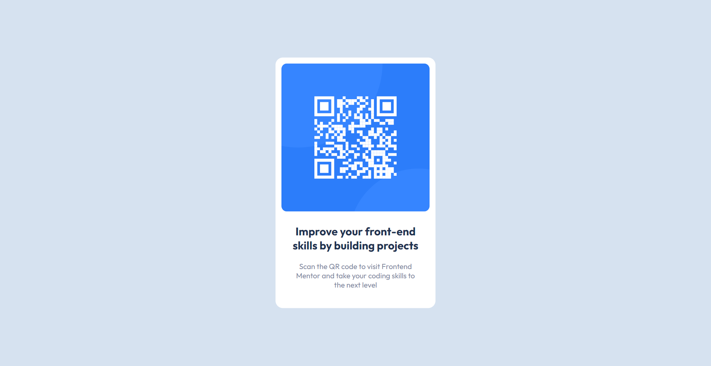

# Frontend Mentor - QR code component solution

The technical I use in this project is basic just HTML CSS only.

# Overview

# Links
- Solution URL: (https://github.com/thikamphon/qr-code-component)
- Live Site URL: (https://thikamphon.github.io/qr-code-component/)

# Built with

- HTML5
- CSS

## Author

- Frontend Mentor - [@thikamphon.RB](https://www.frontendmentor.io/profile/thikamphon)
